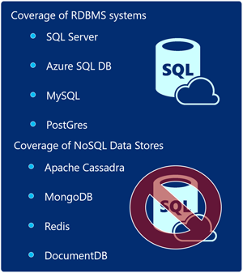

#Synopsis

The purpose of this repository is to connect Java to the worlds top data stores. 2-5, 7, 9 are supported. There are other also supported.

Both SQL and NoSQL stores are supported.

#Code Example

This is the code for MySQL. There are 8 or 9 other data stores supported.

    // Invoke JDBC driver
    Class.forName("com.mysql.jdbc.Driver").newInstance();
    // Setup the connection with the DB
    connect = DriverManager.getConnection(
        "jdbc:mysql://[your ip address of your VM:3306/azurecourse?" +
        "user=mysqluser&password=[your password]&useUnicode=true&characterEncoding=UTF-8");

    // The mysql insert statement
    String query = "insert into courses(id, coursenumber, coursetitle) " +
        "values(?, ?, ?)";
    // Create the mysql insert preparedstatement
    PreparedStatement preparedStmt = connect.prepareStatement(query);
    preparedStmt.setInt(1, 5);
    preparedStmt.setString(2, "0401");
    preparedStmt.setString(3, "Intro to Data");
    // Execute the preparedstatement
    preparedStmt.executeUpdate();
            

Many examples use the JDBC. But data stores like Cassandra, and MongoDB do not. In those cases, the simplest possible code is presented.

#Motivation

There is no single place to show how to connect to the world's data stores for Java. It would be fantastic to make this supported data stores as large as possible. Think http://www.connectionstrings.com as a good example of the goals.

#Installation

These examples were create with Eclipse + Maven. The Eclipse Project files were enormous and therefore omitted for brevity.

#Tests

Unfortunately, JUNIT has not been used thus far. We welcome that addition.

#Contributors

We welcome as many people diving deep into the project at all levels.

#License
MIT License

Copyright (c) 2016 Bruno Terkaly

