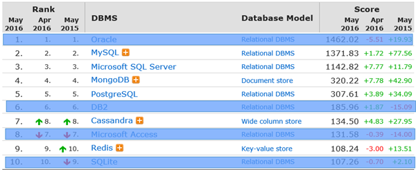
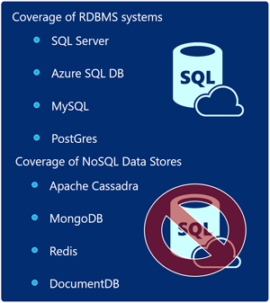

#Synopsis

The purpose of this repository is to connect Java to the worlds top data stores. 2-5, 7, 9 are supported. There are other also supported.

Both SQL and NoSQL stores are supported.

#Code Example

This is the code for MySQL. There are 8 or 9 other data stores supported.

This is just a very small code sample. It does include a number of other statements that you don't see here, such as inserting, and selecting data.

The basic premise is that all code samples need to illustrate as much data-related operations as possible, such as adding or dropping tables, documents, as well as looping through collections of data that have been selected.

    // Invoke JDBC driver
    Class.forName("com.mysql.jdbc.Driver").newInstance();
    // Setup the connection with the DB
    connect = DriverManager.getConnection(
        "jdbc:mysql://[your ip address of your VM:3306/azurecourse?" +
        "user=mysqluser&password=[your password]&useUnicode=true&characterEncoding=UTF-8");

    // The mysql insert statement
    String query = "insert into courses(id, coursenumber, coursetitle) " +
        "values(?, ?, ?)";
    // Create the mysql insert preparedstatement
    PreparedStatement preparedStmt = connect.prepareStatement(query);
    preparedStmt.setInt(1, 5);
    preparedStmt.setString(2, "0401");
    preparedStmt.setString(3, "Intro to Data");
    // Execute the preparedstatement
    preparedStmt.executeUpdate();
            

Many examples use the JDBC. But data stores like Cassandra, and MongoDB do not. In those cases, the simplest possible code is presented.

#Motivation

Today, the ability to interact with data from the Java programming language is widely dispersed and scattered among many different sources. The goal for this repository is to provide a single source of truth for accessing as many data stores as possible from Java.

Think http://www.connectionstrings.com as a good example of the goals.

#Installation

These examples were create with Eclipse + Maven. The Eclipse Project files were enormous and therefore omitted for brevity.

If the community believes that we need to include the entire eclipse project file, I am open to providing that. However, I am trying to avoid the obfuscation of the core elements because Eclipse project files are rather large.

#Tests

Unfortunately, JUNIT has not been used thus far. We welcome that addition.

#Contributors

We welcome as many people diving deep into the project at all levels.

#License
MIT License

Copyright (c) 2016 Bruno Terkaly

